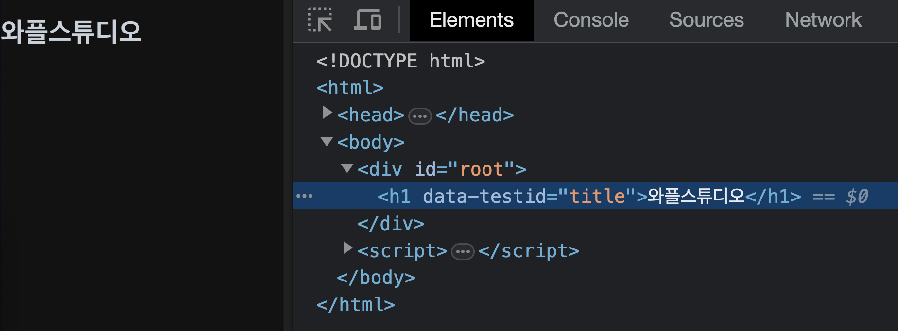
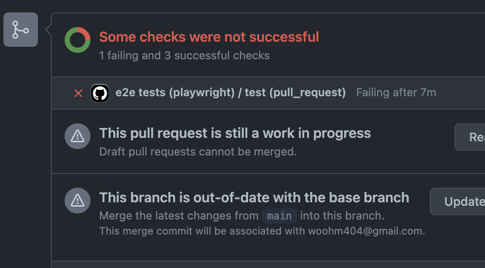

<!-- _class: lead -->

<style>
@import "https://cdnjs.cloudflare.com/ajax/libs/highlight.js/11.8.0/styles/default.min.css";
section {
  justify-content: flex-start;
}
section.lead {
  justify-content: center;
}
section.lead > h1 {
  font-size: 3rem;
}
ul {
  margin-bottom: 1rem;
}
</style>

# Waffle Studio<br>Frontend Seminar - 1.5<br/>

### \*강의자료 work in progress 입니다.

---

<!-- @joongwon part -->

# CSS Layout

---

<!-- @woohm402 part -->

<!-- _class: lead -->

# Testing

---

# 개요

어플리케이션이 잘 동작하는지 확인하려면, 동작하는지 일일이 확인해야 한다

코드가 수정되면 각 로직이 서로 영향을 조금씩이라도 끼치기 때문에, 결국 어플리케이션의 안정성을 보장하려면 전체 어플리케이션을 다시 테스트해야 한다

자동화할 수 없을까?

---

# Unit Test VS Integration Test

<br/>

| unit test                          | integration test                           |
| ---------------------------------- | ------------------------------------------ |
| 하나의 함수나 모듈을 단위로 테스트 | 여러 모듈이나 서비스를 통합하여 테스트     |
| 모듈의 내부 구현에 집중            | 모듈이 상호작용하여 어떻게 동작하는지 집중 |
| `jest` 등                          | `cypress`, `playwright` 등                 |

<br/>

unit test 는 코드 구조에 강하게 결합되어 있으므로 코드 리팩토링을 할 때 unit testcode를 같이 수정해줘야 한다는 단점

integration test 는 테스트 수행이 오래 걸리기 때문에 엄청나게 다양한 케이스들을 커버하기 어려움

---

# Unit Test VS Integration Test

단위 테스트는 하기 어려운 환경이기에, 우리 과제에서는 기본적으로 Integration Test 를 합니다.

---

# TDD ? BDD ?

테스트를 공부하시다 보면 이런 단어들을 보시게 될 텐데요, 테스트를 먼저 구현하고, 시나리오를 기준으로 내가 짤 코드를 결정하는 방법입니다.

이번 과제나 세미나에서 이거까지 할 수는 없어서, 깊게 다루진 않겠습니다. 그런 게 있구나 정도로 넘어가 주시면 좋을 것 같습니다.

---

# 테스트는 완벽한가요?

절대 그렇지 않습니다. 테스트코드가 체크해주는 것은 어디까지나 한계가 있고 결국 어플리케이션이 잘 동작하는지를 체크해줄 수는 없습니다.

그럼에도 테스트코드가 가지는 가치는, 내가 개발해야 할 기능을 명확하게 정의해줌으로서 개발을 더 효율적으로 할 수 있게 해 주고, 내 어플리케이션에 최소한의 안정성을 보장해준다는 데에 있습니다.

---

# Integration Test with Playwright

일반적으로 아래의 프로세스를 거칩니다.

- 브라우저를 연다
- 사이트에 접속한다 (아마도 localhost)
- 테스트케이스들을 수행한다

---

# Integration Test with Playwright

## 예시

```ts
expect(page.getByTestId("title")).toHaveText("와플스튜디오");
```



---

# Integration Test with Playwright

## Live Example

---

# 과제 할 때 어떻게 하면 되나요?

원래는 테스트도 직접 짜면서 TDD를 하는 게 권장되지만, 세미나에서 이렇게까지 하기는 무리가 있기 때문에 테스트케이스는 미리 짜두었습니다. 과제 스펙에 맞추어 `data-testid`를 적절하게 셋업해주시면 됩니다.

직접 짠 게 아닌 남이 짠 테스트코드인지라, 계획하신 마크업과 테스트코드가 요구하는 마크업이 다를 수 있습니다. 분명 정상 동작하고 스펙도 다 잘 돌아가는데 테스트만 터지는 억울한 상황이 있을 수도 있습니다. 저희도 이 부분을 인지하고 있으니, 어려운 게 있다면 편하게 질문주세요 :)

---

# 과제 할 때 어떻게 하면 되나요?

1. 로컬 개발환경

   - 로컬에서 `yarn start`와 같은 명령어를 통해 서버를 띄우고 `http://localhost:{포트}` 에 접속하고,
   - webstorm 이나 vscode 를 이용해서 코드를 수정하면서 개발

2. CI 테스트환경
   - `Continuous Integration`: 지속적인 통합
   - 코드를 푸시하면, CI 도구가 자동으로 내 코드를 기준으로 자동화 테스트 수행
     - 우리는 github actions 를 쓸 거예요

엄밀한 정의는 아니지만, 쉽게 말하면 **_내컴퓨터 vs 내컴퓨터아님_**

---

# 과제 할 때 어떻게 하면 되나요?

## 로컬 개발환경 가이드

1. `5173`번 포트에 과제 어플리케이션 띄우기
   - 개발모드: `yarn dev` / 프로덕션: `yarn build && yarn preview --port 5173`
   - 자동화 테스트는 프로덕션 빌드를 이용하긴 하는데, 기본적으로 개발빌드든 프로덕션 빌드든 둘다 테스트 통과해야 합니다. 개발빌드가 편할거예요
2. git clone 했던 `seminar-2023/react/1/hw-test/` 로 진입
3. `yarn install` 로 의존성 설치하고, `npx playwright@1.38.0 install --with-deps` 로 playwright 브라우저 설치
4. `yarn test` 로 테스트 수행

---

# 과제 할 때 어떻게 하면 되나요?

## CI 테스트환경 가이드

1. 과제 스펙에 있는 대로, `.github/workflows/playwright.yml` 셋업
2. 과제 브랜치 (이번에는 `hw1`) -> `main` 으로 PR 생성
3. 푸시하는 대로 github actions 가 테스트를 계속 돌릴거예요
4. 통과하게 만들어주시면 됩니다

| 실패 시                         | 성공 시                         |
| ------------------------------- | ------------------------------- |
|  |  |

계속 실패 뜨는게 거슬린다면, `playwright.yml`은 로컬 테스트환경에서 개발 다 끝나고 마지막에 세팅해주셔도 좋습니다.

---

# 과제 할 때 어떻게 하면 되나요?

## 테스트 실패 시 디버깅 방법

테스트가 실패했을 때 `http://localhost:9323` 으로 접속하라는 메세지가 뜰 거고, 접속하면 이렇게 뭐가 잘못됐는지 나올거예요.


